# Customer-Segmentation-RFM-Analysis 

## Business Context and Objective

In ecommerce companies like online retails, customer segmentation is necessary in order to understand customers behaviors. It leverages aqcuired customer data like the one we have in our case, transactions data in order to divide customers into groups.

Our goal in this Notebook is to cluster our customers to get insights in:

1. Increasing revenue (Knowing customers who present most of our revenue)

2. Increasing customer retention

3. Discovering Trends and patterns

4. Defining customers at risk

We will do RFM Analysis as a first step and then combine RFM with algorithms (k-means).

RFM Analysis answers these questions:

1. Who are our best customers?
2. Who has the potential to be converted in more profitable customers?
3. Which customers we must retain?
4. Which group of customers is most likely to respond to our current campaign?

## Dataset Information

* InvoiceNo: Invoice number. Nominal, a 6-digit integral number uniquely assigned to each transaction. If this code starts with letter 'c', it indicates a cancellation.
* StockCode: Product (item) code. Nominal, a 5-digit integral number uniquely assigned to each distinct product.
* Description: Product (item) name. Nominal.
* Quantity: The quantities of each product (item) per transaction. Numeric.
* InvoiceDate: Invice Date and time. Numeric, the day and time when each transaction was generated.
* UnitPrice: Unit price. Numeric, Product price per unit in sterling.
* CustomerID: Customer number. Nominal, a 5-digit integral number uniquely assigned to each customer.
* Country: Country name. Nominal, the name of the country where each customer resides.

## Preprocessing

•	As customer clusters may vary by geography, I have restricted the data to only United Kingdom customers, which contains most of our customers historical data.  
•	Deleted cancelled orders  
•	Deleted rows where CustomerID is NA  
•	Restricted the data to one full year because it's better to use a metric per Months or Years in RFM  

Cleaned Dataset Summary:

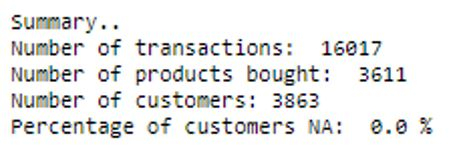

## RFM Analysis

RFM (Recency, Frequency, Monetary) analysis is a customer segmentation technique that uses past purchase behavior to divide customers into groups. RFM helps divide customers into various categories or clusters to identify customers who are more likely to respond to promotions and also for future personalization services.  
RECENCY (R): Days since last purchase  
FREQUENCY (F): Total number of purchases  
MONETARY VALUE (M): Total money this customer spent.  
We will create those 3 customer attributes for each customer.  

### Recency

•	To calculate recency, we need to choose a date point from which we evaluate how many days ago was the customer's last purchase. So, chose the last date available in the dataset.  
•	Then, grouped customers by CustomerID and calculated Last Purchase Date and Recency

•	Now we have the recency attribute created. e.g: Customer with ID = 12346 did his/her last purshace 325 days ago.  

### Frequency

•	Frequency helps us to know how many times a customer purchased from us. To do that we need to check how many invoices are registered by the same customer.  
•	Dropped duplicates and found Frequency

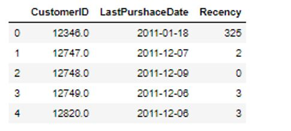

### Monetary

•	Monetary attribute answers the question: How much money did the customer spent over time?  
•	To do that, first, we will create a new column total cost to have the total price per invoice.

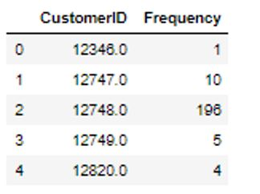

## Create RFM Table

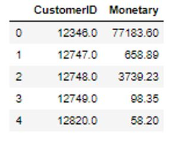

### RFM Table Correctness verification

•	According to above table, Customer with ID = 12346 has recency: 325 days, frequency:1, and monetary: 77183,60 £  

Entries in the dataset for Customer with ID = 12346

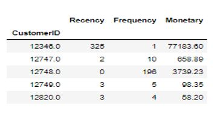

As we can see our RFM table is correct. The first customer bought only once, and only one product with huge amount.

## Customer segments with RFM Model

Before moving to customer segments, Let's see the application of Pareto Principle – commonly referred to as the 80-20 rule on our dataset by applying it to our RFM variables.  
Pareto’s rule says 80% of the results come from 20% of the causes.  
Similarly, 20% customers contribute to 80% of your total revenue. Let's verify that because that will help us know which customers to focus on when marketing new products.  

#### Applying 80-20 rule
#### The 80% of total revenue is:  890679.54

### Customer Ranks

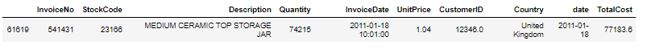

#### Top 20% customers = 773.  
#### The monetary values over the customer with rank <=773 is 976683.3499999999

In our case, the 80% of total revenue is not achieved by the 20% of TOP customers but approximately, it does, because they are less than our 20% TOP customers who achieve it. It would be interesting to study this group of customers because they are those who make our most revenue.

## Applying RFM score formula

The simplest way to create customers segments from RFM Model is to use Quartiles. We assign a score from 1 to 4 to Recency, Frequency and Monetary. Four is the best/highest value, and one is the lowest/worst value. A final RFM score is calculated simply by combining individual RFM score numbers.  

Note: Quintiles (score from 1-5) offer better granularity, in case the business needs that but it will be more challenging to create segments since we will have 555 possible combinations. So, we will use quartiles.

## RFM Segmentation
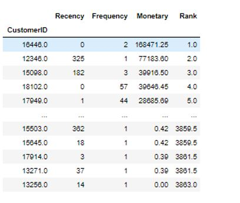

#### Best Recency score = 4: most recently purchase. Best Frequency score = 4: most quantity purchase. Best Monetary score = 4: spent the most.  
Let's see who are our Champions (best customers).
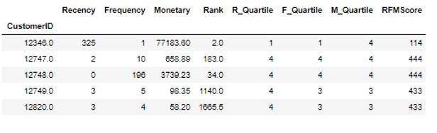

How many customers do we have in each segment?  
Best Customers:  356  
Loyal Customers:  752  
Big Spenders:  966  
Almost Lost:  64  
Lost Customers:  9  
Lost Cheap Customers:  353  

Now that we knew our customers segments we can choose how to target or deal with each segment.  

## Applying K-means clustering on RFM variables

### Correlation Matrix
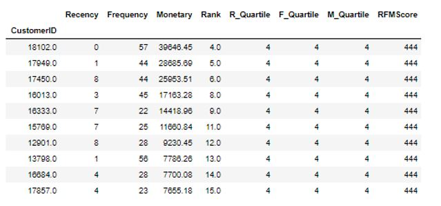

On one hand, we have a negative correlation between:  
•	Recency and Frequency  
•	Recency and Monetary  
On the other hand, the correlation between Monetary and Frequency is positive comparing to negative ones but still not that strong.  
Visualize feature distributions  
To get a better understanding of the dataset, we can construct a scatter matrix of each of the three features present in the RFM data.  

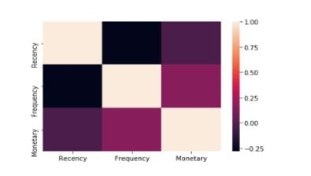

We can notice that we have a skewed distribution of the 3 variables and there exist outliers.
This indicates how normalization is required to make the data features normally distributed as clustering algorithms require them to be normally distributed.

### Data Normalization
Normalised Data:
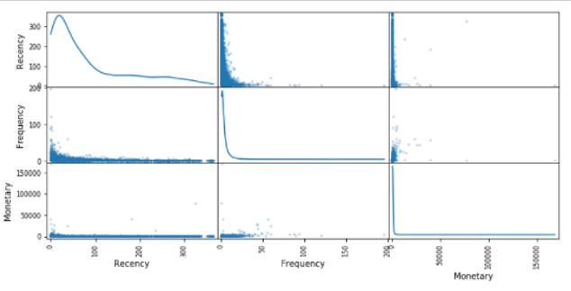
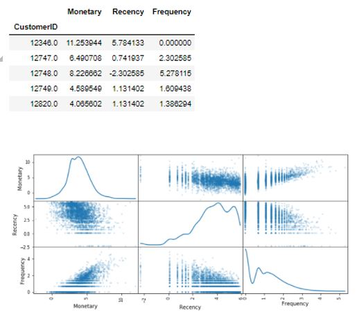

The distributions of Frequency and Monetary are better, more normalized, but it's not the case with Recency Distribution, which is improved but not as much.

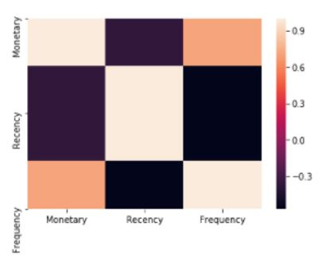

A common challenge with k-means is that you must tell it how many clusters you expect. Figuring out how many clusters we need is not obvious from data, thus we will try different clusters numbers and check their silhouette coefficient. The silhouette coefficient for a data point measures how similar it is to its assigned cluster from -1 (dissimilar) to 1 (similar). The elbow method can be used to determine the number of clusters as well.  
Note: K-means is sensitive to initializations because those initializations are critical to quality of optima found. Thus, we will use smart initialization called k-means++.

### K-Means Clustering Results:
For n_clusters = 2 The average silhouette_score is : 0.38940554101987457  
For n_clusters = 3 The average silhouette_score is : 0.3057052372885249  
For n_clusters = 4 The average silhouette_score is : 0.30967105112450777  
For n_clusters = 5 The average silhouette_score is : 0.2901550155654932  
For n_clusters = 6 The average silhouette_score is : 0.2953268503050095  
For n_clusters = 7 The average silhouette_score is : 0.291290144968737  
For n_clusters = 8 The average silhouette_score is : 0.2924253546998675  
For n_clusters = 9 The average silhouette_score is : 0.2946329729918759  

The best silhouette score obtained is when the number of clusters is 2.  

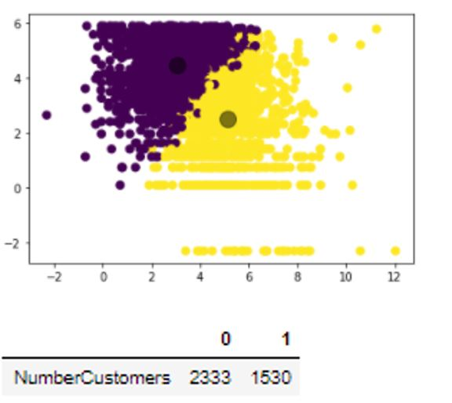

Note(Additional): We can check the median of each variable (Frequency, Monetary, Recency) in each cluster in order to understand what customers does each cluster represent.
Conclusion - Perspective after applying k-means clustering:  
Unfortunately, we didn't obtain a clearly separated clusters. Clusters assignments are muddled. (It may be due to outliers who weren't removed).  
Limitations of k-means clustering:  
There is no assurance that it will lead to the global best solution. Can't deal with different shapes(not circular) and consider one point's probability of belonging to more than one cluster. These disadvantages of k-means mean that for many datasets (especially low-dimensional datasets) it may not perform as well as you might hope.  
Note- Further Explanation: A common practice before doing clustering: Principal Component Analysis (PCA). PCA calculates the dimensions which best maximize variance.It gives directions on how many components to consider. Basically, it does dimensionality reduction while keeping the most important features, characteristics (combinations of features best describe customers). But as we are not dealing with high dimension we won't do it for this case.
